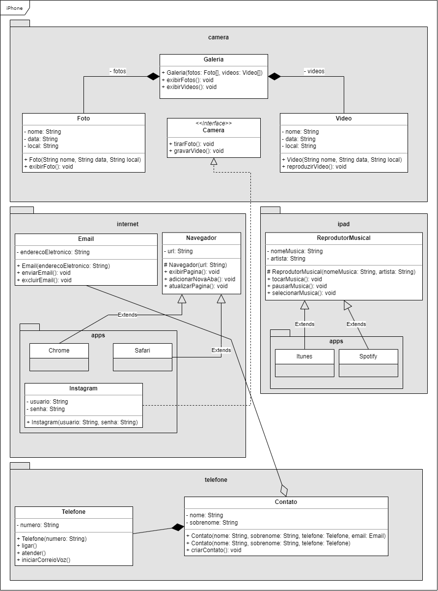

# Orientação a Objetos e UML: Diagramação de Classes do iPhone

Projeto do curso da DIO de Orientação a Objetos e UML.

No projeto, aplicam-se os conceitos de encapsulamento, herança, abstração, polimorfismo e interfaces.

## Diagrama de Classes

